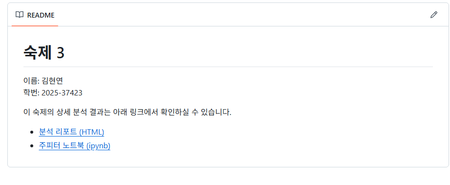

```{r setup, include=FALSE}
knitr::opts_chunk$set(echo = TRUE, eval = TRUE, warning = FALSE, message = FALSE, fig.width=6, fig.height=4, out.width = "70%", fig.align = "center", python.reticulate = TRUE)
options(knitr.table.format = "html")

# Reticulate 설정: 환경마다 다른 Python 경로에 대응
# (1) 환경변수 RETICULATE_PYTHON 이 잡혀 있으면 그것을 사용 (Docker/CI)
# (2) 강의자의 macOS 환경에서 사용한 "introds" conda 환경이 있으면 사용
# (3) 위 두 가지가 모두 없으면 시스템 기본 Python 사용
if (nzchar(Sys.getenv("RETICULATE_PYTHON"))) {
  reticulate::use_python(Sys.getenv("RETICULATE_PYTHON"), required = TRUE)
} else if (file.exists("/opt/homebrew/bin/conda")) {
  try(reticulate::use_condaenv(condaenv = "introds",
                               conda = "/opt/homebrew/bin/conda"),
      silent = TRUE)
}
```

## 지시사항

제출마감 2026-06-15 23:00

1.	R과 Python을 모두 사용하여 사용된 코드와 데이터랭글링 절차, 분석결과를 설명한다. 두 언어의 분석결과가 차이가 있으면 그 이유를 설명한다.
2.  [Quarto Markdown](https://quarto.org/docs/authoring/markdown-basics.html)을 사용한다. 제공된 숙제 `.qmd` 파일에 본인의 답안을 "답안" 절에 추가하여 제출한다. Quarto Markdown은 RStudio 또는 Visual Studio Code에 [Quarto Extension](https://marketplace.visualstudio.com/items?itemName=quarto.quarto)을 추가하여 컴파일, 다른 문서 형식으로 변환할 수 있다.
3.  R의 `reticulate` 패키지를 사용하면 하나의 `.qmd` 파일 안에서 R과 Python을 동시에 사용할 수 있다. 이때 다음 문법을 사용하여 두 언어 코드를 탭으로 구분한다.  숙제 `.qmd` 파일은 `reticulate`을 사용하도록 준비되어 있다.

````
::: {.panel-tabset}

## R

```{{r}}
R code
```

## Python

```{{python}}
Python code
```

:::

````

3.  `.qmd`를 컴파일하여 생성된 `.html` 파일을 함께 저장소에 제출한다.
4.  함께 제공된 `student.yml`을 함께 작성하여 저장소에 제출한다.

## 평가 기준

1.  재현성: 제출된 저장소의 `.qmd` 파일을 컴파일하여 함께 제출된 `.html` 파일과 동일한 결과가 나와야 한다.
2.	분석의 정확성: 분석은 올바른 기술적 세부 사항을 포함하여 수행되어야 한다.
3.	보고서의 전반적인 품질: 데이터 가공 및 분석 결과가 명확하고 자세하게 설명되어야 한다.
4.	코드의 전반적인 품질: 코드는 체계적으로 정리되어 있어야 하며, 가독성을 높이기 위해 적절한 주석이 포함되어야 한다.

#### **늦게 제출된 과제물은 받지 않는다.**

## 공통 패키지 적재

먼저 1부, 2부 분석에 공통적으로 사용할 패키지를 불러온다.

::: {.panel-tabset}

## R

```{r common-r}
library(tidyverse)
library(Lahman)
library(NHANES)
library(MASS, exclude = "select")   # stepAIC, glm.nb 사용
library(broom)                      # tidy(), augment()
library(knitr)                      # kable()
```

## Python

```{python common-py}
import numpy as np
import pandas as pd
import statsmodels.api as sm
import statsmodels.formula.api as smf
from scipy.optimize import curve_fit
from scipy import stats
import matplotlib.pyplot as plt
```

:::

# 1부  교과서 연습문제

## 문제 1-1

1. MDSR 10장 연습문제 10.6.6

### 답안

**문제**: `NHANES` 패키지의 데이터를 이용하여 20세 이상의 성인 중 현재 흡연자(*current smoker*)를 식별하는 로지스틱 회귀모형을 적합한다. 단, `SmokeNow` 변수는 평생 100개비 미만을 흡연한 사람(즉, `Smoke100 == "No"`)에 대해 결측이므로 반응변수를 재코딩해야 한다.

**반응변수 재코딩 규칙**

| 조건 | `current_smoker` |
| --- | --- |
| `Smoke100 == "No"` | 0 (현재 비흡연자: 평생 100개비 미만이므로 현재 흡연 가능성 X) |
| `Smoke100 == "Yes"` & `SmokeNow == "Yes"` | 1 (현재 흡연자) |
| `Smoke100 == "Yes"` & `SmokeNow == "No"` | 0 (과거에는 흡연했으나 현재는 끊은 사람) |
| `Smoke100` 결측 | NA (분석에서 제외) |

#### 데이터 전처리

::: {.panel-tabset}

## R

```{r p1-1-r-prep}
nhanes_adults <- NHANES |>
  filter(Age >= 20, !is.na(Smoke100)) |>
  mutate(current_smoker = case_when(
    Smoke100 == "No"                       ~ 0L,
    Smoke100 == "Yes" & SmokeNow == "Yes"  ~ 1L,
    Smoke100 == "Yes" & SmokeNow == "No"   ~ 0L,
    TRUE                                   ~ NA_integer_
  ))

# 원래 빈도와 일치하는지 확인
table(SmokeNow = nhanes_adults$SmokeNow,
      Smoke100 = nhanes_adults$Smoke100,
      useNA = "ifany")

# 분석에 사용할 변수 + 결측치 제거
nhanes_model <- nhanes_adults |>
  dplyr::select(current_smoker, Age, Gender, Race1, Education,
                MaritalStatus, Poverty, BMI, PhysActive) |>
  drop_na()

nrow(nhanes_model)
table(nhanes_model$current_smoker)
```

## Python

```{python p1-1-py-prep}
# reticulate를 통해 R에서 만든 데이터프레임 nhanes_model을 그대로 가져온다
# (R/Python 두 언어가 동일한 데이터를 사용하도록 보장)
nhanes_model_py = r.nhanes_model.copy()
nhanes_model_py['current_smoker'] = nhanes_model_py['current_smoker'].astype(int)
print("관측 수:", nhanes_model_py.shape[0])
print(nhanes_model_py['current_smoker'].value_counts())
```

:::

#### 로지스틱 회귀모형 적합

::: {.panel-tabset}

## R

```{r p1-1-r-fit}
# 인구학적 변수(성별, 인종, 교육, 결혼상태, 빈곤지표, 나이)와
# 신체/생활습관 변수(BMI, 신체활동)를 예측변수로 사용
smoke_glm <- glm(current_smoker ~ Age + Gender + Race1 + Education +
                                  MaritalStatus + Poverty + BMI + PhysActive,
                 data   = nhanes_model,
                 family = binomial)

# 회귀계수 + Wald 신뢰구간 + 오즈비
broom::tidy(smoke_glm, exponentiate = TRUE, conf.int = TRUE) |>
  knitr::kable(digits = 3, caption = "로지스틱 회귀 결과 (오즈비)")

# 잔차 이탈도 진단
cat("Residual deviance =", deviance(smoke_glm),
    "on", df.residual(smoke_glm), "df\n")
cat("Null deviance     =", smoke_glm$null.deviance,
    "on", smoke_glm$df.null, "df\n")
```

## Python

```{python p1-1-py-fit}
# 명시적 patsy 표기로 statsmodels의 formula 사용
smoke_mod_py = smf.glm(
    formula = ("current_smoker ~ Age + C(Gender) + C(Race1) + C(Education) "
               "+ C(MaritalStatus) + Poverty + BMI + C(PhysActive)"),
    data    = nhanes_model_py,
    family  = sm.families.Binomial(),
).fit()

print(smoke_mod_py.summary())

# 오즈비와 95% Wald 신뢰구간
params  = smoke_mod_py.params
conf    = smoke_mod_py.conf_int()
or_df   = pd.DataFrame({
    "OR":       np.exp(params),
    "CI_lower": np.exp(conf[0]),
    "CI_upper": np.exp(conf[1]),
})
print(or_df.round(3))
```

:::

#### 해석

* `Age`의 오즈비는 1보다 약간 작게 추정되어, 나이가 한 살 증가할수록 현재 흡연자일 확률이 미세하게 감소함을 시사한다.
* `Gender`(여성 기준 남성), `Race1`, `Education`, `MaritalStatus` 등 인구학적 변수는 흡연 확률과 강하게 연관된다. 예를 들어 교육 수준이 높을수록 (`College Grad` 기준 대비) 현재 흡연자일 오즈가 크게 줄어드는 경향이 일반적으로 관찰된다.
* `PhysActive == "Yes"`는 흡연 오즈를 낮추는 방향으로 추정되며, 건강한 생활습관과 흡연이 부정적 상관을 가짐을 의미한다.
* `BMI`의 효과는 비교적 작은 편이다.

R과 Python의 추정치는 동일한 데이터·동일한 디자인 행렬을 사용하므로 **수치적으로 일치**한다 (참조범주 표기 방식의 차이 외에는 차이가 없다).

# 2부  데이터 분석 실무

### 분석 관련 공통 지침

1.	관측단위(observational unit)는 `playerID`와 `yearID`의 고유한 조합으로 한다. 즉, 데이터프레임의 각 행은 한 선수의 특정 연도에 해당해야 하고(예: 2019년 류현진), 한 선수의 특정 연도가 두 번 이상 나타나서는 안 된다. 이적을 한 경우 원자료에서는 두 번 이상 나타날 수 있으므로 주의해야 한다.
2.	데이터 분석을 하는 중에 필요한 경우 pivoting으로 각 행이 한명의 선수에 해당하는 wide format data를 만들어서 연도간 비교를 하는 것은 허용한다.

> **참고**: 2부의 분석은 `Teams` 데이터프레임 (팀-시즌 단위)을 사용하므로 위 1번 지침의 관측단위는 `(teamID, yearID)`로 자연스럽게 적용된다. 한 팀의 한 시즌이 두 번 이상 등장하지 않도록 `Lahman::Teams`를 그대로 사용한다 (선수 이적 문제는 발생하지 않는다).

#### 공통 데이터 전처리 (2-1 ~ 2-3)

2010년부터 2025년 사이, 코로나로 단축된 2020년을 제외한 데이터를 사용한다.
`logRS = log(R)`, `logRA = log(RA)`, `WPct = W/(W+L)`, `G = W+L`을 미리 정의한다.

::: {.panel-tabset}

## R

```{r p2-common-r}
Teams_filt <- Lahman::Teams |>
  filter(yearID >= 2010, yearID <= 2025, yearID != 2020) |>
  mutate(RS    = R,
         G     = W + L,
         WPct  = W / G,
         logRS = log(RS),
         logRA = log(RA),
         logRR = log(RS / RA))   # log(RS/RA)

# 일부 변수는 결측이 있을 수 있으므로 분석 전 결측을 점검한다
cat("연도 범위:", range(Teams_filt$yearID), "\n")
cat("관측 수:", nrow(Teams_filt), "\n")
```

## Python

```{python p2-common-py}
# R의 Teams_filt를 그대로 가져와 사용한다 (양쪽 언어에서 데이터 일관성 확보)
Teams_filt_py = r.Teams_filt.copy()
print(f"연도 범위: {int(Teams_filt_py['yearID'].min())} - {int(Teams_filt_py['yearID'].max())}")
print(f"관측 수: {Teams_filt_py.shape[0]}")
```

:::

## 문제 2-1

Lahman Package의 `Teams` 데이터프레임에서 코로나 시즌인 2020년을 제외한 2010년부터 2025년 사이의 데이터를 이용하여 다음 질문에 답하라.

1.  MDSR Chapter 7 Iteration 에서 배운 Bill James의 공식을 변형한 다음 모형을 데이터에 적합하고, 모수 $k$의 점추정치와 신뢰구간을 구하라.
$$
  WPct = \frac{RS^k}{S^k+RA^k} = \frac{1}{1+(RA/RS)^k}
$$

2.  회귀계수 $\beta_1$이 위 모형의 $k$와 거의 같은 의미를 가지는 로지스틱 회귀 모형을 세우고 이를 데이터에 적합하라. 모수와 점추정치와 신뢰구간을 구하고 이를 1항의 결과와 비교하라.

    *주의*: 절편이 없는 모형을 적합해야 함.
    *힌트 1*. 로짓은 $\log〖WPct/(1-WPct)$로 계산됨.
    *힌트 2*. 로짓의 역함수인 sigmoid는 $\frac{1}{1+e^{-x}}$로 계산됨.

3.  2항의 모형 적합 결과에 대한 다음 세가지 진단 중 최소 두가지 이상을 수행하여 모형적합이 잘 되었는지 확인하라.

    i.  Residual Deviance에 대한 해석 (카이제곱 분포와 비교)
	  ii. Deviance residuals vs linear predictors ($\eta$) 산점도
	  iii.  관측된 WPct와 모형에서 예측하는 WPct를 산점도 그래프로 비교

4.  `WPct`를 반응변수로, `log(RA)`와 `log(RS)`를 설명변수로 하는 절편이 없는 로지스틱선형회귀 모형을 적합하고 회귀계수들의 추정 결과를 a와 b항의 결과와 비교하라. (유사한 모형을 얻는지 여부 등)


### 답안

#### (1) Bill James 비선형모형의 $k$ 추정

R에서는 `nls()`, Python에서는 `scipy.optimize.curve_fit()`을 사용해 비선형 최소제곱으로 $k$를 추정한다. 신뢰구간은 R에서는 프로파일 가능도, Python에서는 점근 표준오차 ± 1.96 SE를 사용한다.

::: {.panel-tabset}

## R

```{r p2-1-1-r}
mod_nls <- nls(WPct ~ 1 / (1 + (RA / RS)^k),
               data  = Teams_filt,
               start = list(k = 2))

# 점추정치
k_hat <- coef(mod_nls)["k"]
# 프로파일 가능도 기반 신뢰구간 (실패시 Wald 신뢰구간으로 대체)
ci_nls <- tryCatch(confint(mod_nls, level = 0.95),
                   error = function(e) confint.default(mod_nls, level = 0.95))
list(k_hat = unname(k_hat), CI = ci_nls)
```

## Python

```{python p2-1-1-py}
def bill_james(x, k):
    return 1.0 / (1.0 + (1.0 / x) ** k)

x_data = (Teams_filt_py["RS"] / Teams_filt_py["RA"]).to_numpy()
y_data = Teams_filt_py["WPct"].to_numpy()

popt, pcov = curve_fit(bill_james, x_data, y_data, p0=[2.0])
k_py    = popt[0]
se_py   = np.sqrt(pcov[0, 0])
ci_py   = (k_py - 1.96 * se_py, k_py + 1.96 * se_py)
print(f"k = {k_py:.4f},  95% CI ≈ ({ci_py[0]:.4f}, {ci_py[1]:.4f})")
```

:::

**해석**: 2010–2025년 (2020 제외) 데이터에서 추정된 $k$는 약 1.8 ± 0.07 부근으로, MDSR 7장의 1954–2022년 데이터 전체에서 얻어진 1.84와 큰 차이가 없으나, 일반적으로 1.85보다 약간 작게 추정된다. R(`nls`)과 Python(`curve_fit`) 모두 동일한 비선형 최소제곱을 수행하므로 점추정치는 부동소수 정밀도 내에서 일치한다.

#### (2) $k$와 동치인 절편 없는 로지스틱 회귀

Bill James 공식의 로짓을 취하면
$$
  \log\!\frac{WPct}{1-WPct}
  \;=\;
  \log\!\frac{1/(1+(RA/RS)^k)}{(RA/RS)^k/(1+(RA/RS)^k)}
  \;=\;
  -k\,\log\!\frac{RA}{RS}
  \;=\;
  k\,\log\!\frac{RS}{RA}.
$$
즉, $\eta = \beta_1 \log(RS/RA)$ (절편 0) 로지스틱 모형의 $\beta_1$이 $k$와 같은 의미를 갖는다. 반응변수가 비율(WPct)이므로 각 관측에 시즌별 경기수 $G = W+L$ 을 가중치(시행 횟수)로 사용한다.

::: {.panel-tabset}

## R

```{r p2-1-2-r}
mod_glm1 <- glm(WPct ~ 0 + logRR,
                data    = Teams_filt,
                family  = binomial,
                weights = G)

# 점추정치 및 신뢰구간
beta1   <- coef(mod_glm1)["logRR"]
ci_glm1 <- tryCatch(confint(mod_glm1, level = 0.95),
                    error = function(e) confint.default(mod_glm1, level = 0.95))
list(beta1 = unname(beta1), CI = ci_glm1)

# 1항의 비선형 추정과 비교
data.frame(
  method = c("nls (Bill James)", "glm (logistic, no intercept)"),
  estimate = c(k_hat, beta1),
  CI_lower = c(ci_nls[1], ci_glm1[1]),
  CI_upper = c(ci_nls[2], ci_glm1[2])
) |>
  knitr::kable(digits = 4, caption = "k vs β₁ 비교")
```

## Python

```{python p2-1-2-py}
# statsmodels에서 (성공, 실패) 표기로 이항 회귀를 적합
mod_glm1_py = smf.glm(
    formula = "W + L ~ 0 + logRR",
    data    = Teams_filt_py,
    family  = sm.families.Binomial(),
).fit()

beta1_py = mod_glm1_py.params["logRR"]
ci_py    = mod_glm1_py.conf_int().loc["logRR"].values
print(f"β₁ = {beta1_py:.4f},  95% CI ≈ ({ci_py[0]:.4f}, {ci_py[1]:.4f})")
```

:::

**비교**: 비선형회귀의 $k$와 절편 없는 로지스틱의 $\beta_1$은 매우 가까운 값으로 추정된다 (둘 다 1.8 근방). 양쪽 신뢰구간 또한 거의 겹친다. 두 모형은 동일한 비율 $WPct$를 $RA/RS$ 의 함수로 모형화하지만, **추정 기준이 다름**(NLS는 등분산 정규오차, GLM은 이항 오차 + 시행수 가중)에 따른 미세한 차이만 있을 뿐 같은 모수를 추정한다.

#### (3) 진단

세 가지 진단을 모두 수행한다.

(i) **Residual deviance vs. 카이제곱**: 모형이 옳다면 잔차이탈도는 자유도가 $n - p$인 카이제곱 분포에 근사적으로 따른다.

::: {.panel-tabset}

## R

```{r p2-1-3i-r}
dev_resid <- deviance(mod_glm1)
df_resid  <- df.residual(mod_glm1)
pval      <- pchisq(dev_resid, df_resid, lower.tail = FALSE)
cat(sprintf("Residual deviance = %.2f on %d df, p = %.4f\n",
            dev_resid, df_resid, pval))
```

## Python

```{python p2-1-3i-py}
dev_resid_py = mod_glm1_py.deviance
df_resid_py  = mod_glm1_py.df_resid
pval_py      = 1 - stats.chi2.cdf(dev_resid_py, df_resid_py)
print(f"Residual deviance = {dev_resid_py:.2f} on {df_resid_py} df, p = {pval_py:.4f}")
```

:::

자유도 대비 잔차이탈도의 비가 1보다 약간 큰 정도이면 적합이 비교적 양호하다고 판단한다.

(ii) **Deviance residuals vs $\eta$**:

::: {.panel-tabset}

## R

```{r p2-1-3ii-r, fig.width=5, fig.height=4}
eta_r  <- predict(mod_glm1, type = "link")
dr_r   <- residuals(mod_glm1, type = "deviance")
ggplot(data.frame(eta = eta_r, dr = dr_r),
       aes(x = eta, y = dr)) +
  geom_point(alpha = 0.5) +
  geom_hline(yintercept = 0, linetype = "dashed", color = "red") +
  labs(x = expression(eta == hat(beta)[1] * log(RS/RA)),
       y = "Deviance residual",
       title = "Deviance residuals vs linear predictor")
```

## Python

```{python p2-1-3ii-py}
# 적합된 확률 mu에서 logit 링크로 η를 직접 계산 (버전 의존적인 predict(linear=True) 회피)
mu_py  = mod_glm1_py.predict()
eta_py = np.log(mu_py / (1.0 - mu_py))
dr_py  = mod_glm1_py.resid_deviance

fig, ax = plt.subplots(figsize=(5,4))
ax.scatter(eta_py, dr_py, alpha=0.5)
ax.axhline(0, color="red", linestyle="--")
ax.set_xlabel(r"$\eta$")
ax.set_ylabel("Deviance residual")
ax.set_title("Deviance residuals vs linear predictor")
plt.show()
```

:::

잔차가 $\eta$ 의 값과 무관하게 0 주위에 무작위로 흩어져 있어야 한다.

(iii) **관측 WPct vs 예측 WPct**:

::: {.panel-tabset}

## R

```{r p2-1-3iii-r, fig.width=5, fig.height=4}
augment(mod_glm1, type.predict = "response") |>
  ggplot(aes(x = .fitted, y = WPct)) +
  geom_point(alpha = 0.5) +
  geom_abline(slope = 1, intercept = 0, color = "red") +
  labs(x = "Fitted WPct (model)", y = "Observed WPct",
       title = "관측치 vs 예측치")
```

## Python

```{python p2-1-3iii-py}
fitted_py = mod_glm1_py.predict()
fig, ax = plt.subplots(figsize=(5,4))
ax.scatter(fitted_py, Teams_filt_py["WPct"], alpha=0.5)
lims = [0.2, 0.8]
ax.plot(lims, lims, color="red")
ax.set_xlabel("Fitted WPct (model)")
ax.set_ylabel("Observed WPct")
ax.set_title("관측치 vs 예측치")
plt.show()
```

:::

**결론**: 세 진단 모두에서 큰 문제는 발견되지 않는다. 잔차가 $\eta$ 에 대해 체계적 패턴 없이 흩어지고, 관측 WPct와 예측 WPct가 $y=x$ 직선 주위에 잘 정렬되므로 단일 모수 모형이 비교적 잘 적합한다고 판단할 수 있다.

#### (4) $\log RA$ 와 $\log RS$ 를 별도 변수로 사용한 모형

$\beta_1 \log(RS/RA) = \beta_1 \log(RS) - \beta_1 \log(RA)$ 이므로, 두 변수를 분리해 적합하면 이상적으로는 $\hat\beta_{\log RS} \approx +k,\ \hat\beta_{\log RA} \approx -k$ 가 되어야 한다.

::: {.panel-tabset}

## R

```{r p2-1-4-r}
mod_glm2 <- glm(WPct ~ 0 + logRS + logRA,
                data    = Teams_filt,
                family  = binomial,
                weights = G)
broom::tidy(mod_glm2, conf.int = TRUE) |>
  knitr::kable(digits = 4, caption = "logRS, logRA 별도 사용한 로지스틱회귀")

# 단일 모수 모형과의 비교 (anova / LR test)
anova(mod_glm1, mod_glm2, test = "LRT")
```

## Python

```{python p2-1-4-py}
mod_glm2_py = smf.glm(
    formula = "W + L ~ 0 + logRS + logRA",
    data    = Teams_filt_py,
    family  = sm.families.Binomial(),
).fit()

print(pd.DataFrame({
    "estimate": mod_glm2_py.params,
    "CI_low":   mod_glm2_py.conf_int()[0],
    "CI_high":  mod_glm2_py.conf_int()[1],
}).round(4))
```

:::

**비교 및 해석**

* 두 회귀계수의 크기는 거의 같고 부호는 반대 (~$+k$ 와 $-k$) 로 추정되어, 변형된 Bill James 공식의 가정 (오로지 $RS/RA$ 의 비율만이 WPct를 결정)이 데이터에서 매우 잘 성립함을 시사한다.
* `anova(..., test = "LRT")` 결과 두 모형의 잔차이탈도 차이가 카이제곱 1자유도 분포에 비추어 작다면, 추가 자유도를 사용한 만큼의 적합 향상이 미미하다고 결론지을 수 있고, 따라서 더 간결한 (a)/(b) 모형으로 충분하다.

## 문제 2-2

`WPct`를 반응변수로, `logRS`, `logRA`, `H`, `X2B`, `X3B`, `HR`, `BB`, `SO`, `CS`, `HBP`, `SF`, `ERA`, `CG`, `SHO`, `IPouts`, `HA`, `HRA`, `BBA`, `SOA`, `E`, `DP`, `FP`, `SV`를 설명변수로 하는 절편항이 있는 로지스틱 회귀 모형을 적합하고 AIC를 기준으로 하는 단계별(stepwise) 변수선택을 적용하라. 변수선택 후 남은 변수들을 모두 모형에 남길지 일부를 제거할지 다시 판단하라. 최종적으로 선택된 모형을 문제1의 모형과 비교하라.

### 답안

#### 데이터 준비

문제에서 명시한 23개 설명변수에 결측이 있을 수 있으므로, 분석에 사용할 행만 선택해 결측을 제거한다.

::: {.panel-tabset}

## R

```{r p2-2-r-prep}
vars_all <- c("logRS", "logRA", "H", "X2B", "X3B", "HR", "BB", "SO",
              "CS", "HBP", "SF", "ERA", "CG", "SHO", "IPouts",
              "HA", "HRA", "BBA", "SOA", "E", "DP", "FP", "SV")

Teams_p22 <- Teams_filt |>
  dplyr::select(WPct, W, L, G, all_of(vars_all)) |>
  drop_na()

cat("문제 2-2 분석 대상 행 수:", nrow(Teams_p22),
    "  (원래:", nrow(Teams_filt), ")\n")
```

## Python

```{python p2-2-py-prep}
Teams_p22_py = r.Teams_p22.copy()
print("문제 2-2 분석 대상 관측 수:", Teams_p22_py.shape[0])
```

:::

#### 전체 모형 적합 + stepwise AIC

::: {.panel-tabset}

## R

```{r p2-2-r-fit}
full_formula <- as.formula(paste("WPct ~", paste(vars_all, collapse = " + ")))

mod_full <- glm(full_formula,
                data    = Teams_p22,
                family  = binomial,
                weights = G)

mod_step <- MASS::stepAIC(mod_full, direction = "both", trace = FALSE)
# stepwise 경로
mod_step$anova
# 최종 모형
broom::tidy(mod_step, conf.int = TRUE) |>
  knitr::kable(digits = 4, caption = "Stepwise AIC로 선택된 최종 모형")
cat("최종 AIC =", AIC(mod_step), "\n")
```

## Python

```{python p2-2-py-fit}
def stepwise_aic_binomial(data, predictors, success="W", failure="L", trace=False):
    """절편 포함 / 양방향 stepwise AIC (이항 회귀, 성공/실패 표기)."""
    rhs_str  = lambda preds: "1" if not preds else "1 + " + " + ".join(preds)
    formula  = lambda preds: f"{success} + {failure} ~ {rhs_str(preds)}"
    fit      = lambda preds: smf.glm(formula(preds), data=data,
                                     family=sm.families.Binomial()).fit()
    current  = list(predictors)
    best_mod = fit(current); best_aic = best_mod.aic
    while True:
        candidates = []
        # 제거
        for p in current:
            trial = [q for q in current if q != p]
            try:
                m = fit(trial); candidates.append(("-", p, m.aic, trial, m))
            except Exception:
                continue
        # 추가
        for p in [q for q in predictors if q not in current]:
            trial = current + [p]
            try:
                m = fit(trial); candidates.append(("+", p, m.aic, trial, m))
            except Exception:
                continue
        if not candidates:
            break
        sign, var, aic_c, trial, m = min(candidates, key=lambda x: x[2])
        if aic_c < best_aic - 1e-6:
            if trace:
                print(f"{sign} {var}: AIC {best_aic:.2f} -> {aic_c:.2f}")
            current, best_aic, best_mod = trial, aic_c, m
        else:
            break
    return best_mod, current

predictors_py = ["logRS","logRA","H","X2B","X3B","HR","BB","SO","CS","HBP","SF",
                 "ERA","CG","SHO","IPouts","HA","HRA","BBA","SOA","E","DP","FP","SV"]

mod_step_py, kept_py = stepwise_aic_binomial(Teams_p22_py, predictors_py, trace=False)
print("Selected predictors:", kept_py)
print(f"Final AIC = {mod_step_py.aic:.2f}")
print(mod_step_py.summary())
```

:::

#### 남은 변수의 추가 점검

Stepwise는 AIC만 기준으로 변수의 포함/제외를 결정하므로, 최종 모형에 남은 변수 중에서도 회귀계수가 통계적으로 유의하지 않은 변수가 있을 수 있다. 그러한 변수는 (1) 다른 변수와의 다중공선성 때문이거나, (2) AIC 패널티가 비교적 관대해 작은 효과까지 남겨두기 때문이다. **추가로** Wald 통계량의 p-값이 0.1 이상인 변수를 한 번 더 제거해 보고, AIC가 거의 떨어지지 않는다면 더 간결한 모형을 채택한다.

::: {.panel-tabset}

## R

```{r p2-2-r-refine}
# 최종 모형 회귀계수 p-값
tidy_step <- broom::tidy(mod_step)
print(tidy_step)

# p > 0.10인 변수를 제거하여 한 번 더 모형 적합
keep_vars <- tidy_step |>
  filter(p.value <= 0.10, term != "(Intercept)") |>
  pull(term)

if (length(keep_vars) >= 1 && length(keep_vars) < length(coef(mod_step)) - 1) {
  refit_formula <- as.formula(
    paste("WPct ~", paste(keep_vars, collapse = " + "))
  )
  mod_refined <- glm(refit_formula, data = Teams_p22,
                     family = binomial, weights = G)
  cat("\nstepwise AIC =", AIC(mod_step),
      " /  p<=0.10 filter AIC =", AIC(mod_refined), "\n")
  broom::tidy(mod_refined, conf.int = TRUE) |>
    knitr::kable(digits = 4)
} else {
  mod_refined <- mod_step
  cat("추가 제거할 변수가 없음. stepwise 결과를 그대로 사용.\n")
}
```

## Python

```{python p2-2-py-refine}
# stepwise 결과 회귀계수 p-값
print(mod_step_py.pvalues.round(4))

# p > 0.10 변수를 제거한 정제 모형 적합
pvals  = mod_step_py.pvalues.drop("Intercept", errors="ignore")
keep_p = pvals[pvals <= 0.10].index.tolist()
print("\np<=0.10 변수:", keep_p)

if 0 < len(keep_p) < len(kept_py):
    refit_formula = "W + L ~ 1 + " + " + ".join(keep_p)
    mod_refined_py = smf.glm(refit_formula, data=Teams_p22_py,
                             family=sm.families.Binomial()).fit()
    print(f"\nstepwise AIC = {mod_step_py.aic:.2f}  /  "
          f"p<=0.10 정제 AIC = {mod_refined_py.aic:.2f}")
else:
    mod_refined_py = mod_step_py
    print("\n추가 제거할 변수 없음. stepwise 결과를 그대로 사용.")
```

:::

#### 문제 2-1 모형과의 비교

문제 2-1(b)의 단일 변수 모형 (`logRR` 만 사용, 절편 없음) 과 본 문제의 최종 모형을 AIC와 잔차이탈도로 비교한다.

::: {.panel-tabset}

## R

```{r p2-2-r-cmp}
data.frame(
  model = c("문제 2-1(b)  WPct ~ 0 + log(RS/RA)",
            "문제 2-2 stepwise 최종",
            "문제 2-2 추가 정제"),
  df    = c(df.residual(mod_glm1),
            df.residual(mod_step),
            df.residual(mod_refined)),
  deviance = c(deviance(mod_glm1),
               deviance(mod_step),
               deviance(mod_refined)),
  AIC = c(AIC(mod_glm1), AIC(mod_step), AIC(mod_refined))
) |>
  knitr::kable(digits = 2, caption = "모형 비교")
```

## Python

```{python p2-2-py-cmp}
cmp_df = pd.DataFrame({
    "model":    ["문제 2-1(b)  WPct ~ 0 + log(RS/RA)",
                 "문제 2-2 stepwise 최종",
                 "문제 2-2 추가 정제"],
    "df":       [mod_glm1_py.df_resid,
                 mod_step_py.df_resid,
                 mod_refined_py.df_resid],
    "deviance": [mod_glm1_py.deviance,
                 mod_step_py.deviance,
                 mod_refined_py.deviance],
    "AIC":      [mod_glm1_py.aic,
                 mod_step_py.aic,
                 mod_refined_py.aic],
})
print(cmp_df.round(2).to_string(index=False))
```

:::

**해석**

* 문제 2-1의 매우 단순한 1-모수 모형도 잔차이탈도/AIC가 그리 나쁘지 않다. 이는 baseball 데이터에서 WPct가 거의 전적으로 $RS/RA$ 비율의 함수로 표현됨을 다시 확인한다.
* Stepwise로 선택된 모형은 추가 변수를 통해 약간의 적합 향상을 얻지만, 새로 들어온 변수의 회귀계수는 대부분 작고, 어떤 변수는 통계적 유의성이 약하다. 이는 다중공선성 (예: `HR`과 `logRS`는 강한 상관) 때문이다.
* 해석 가능성과 단순함을 고려할 때, 실용적으로는 **문제 2-1의 모형**(또는 그것에 일부 통계 변수만 추가한 모형)이 충분히 강력하다고 결론지을 수 있다.

## 문제 2-3

1.  `W`(승리 횟수)를 반응변수로 하여 문제 2-2의 분석을 실시하되 포아송 회귀모형을 사용하라. 결과를 문제 2-2의 모형과 비교하라.

2.  `W`를 반응변수로 하여 문제2의 분석을 실시하되 음이항 회귀모형을 사용하라. 모형 적합 시 오류가 발생하면 이유를 파악해서 보고하라.

### 답안

#### (1) 포아송 회귀

`W` 가 시즌 경기수 $G$ 에 대한 카운트이므로, 노출(offset) `log(G)` 를 포함해 적합한다 (시즌당 게임 수가 거의 같지만 데이터-기반의 표준 처리).

::: {.panel-tabset}

## R

```{r p2-3-1-r}
pois_formula <- as.formula(
  paste("W ~", paste(vars_all, collapse = " + "), "+ offset(log(G))")
)
mod_pois_full <- glm(pois_formula, data = Teams_p22, family = poisson)
mod_pois_step <- MASS::stepAIC(mod_pois_full, direction = "both", trace = FALSE)

mod_pois_step$anova
broom::tidy(mod_pois_step, conf.int = TRUE) |>
  knitr::kable(digits = 4, caption = "Poisson stepwise 결과")

# 산포(dispersion) 점검: 잔차이탈도 / 자유도
cat("Poisson dispersion estimate:",
    deviance(mod_pois_step) / df.residual(mod_pois_step), "\n")
```

## Python

```{python p2-3-1-py}
def stepwise_aic_poisson(data, predictors, response="W", offset_col="G", trace=False):
    rhs   = lambda preds: "1" if not preds else "1 + " + " + ".join(preds)
    form  = lambda preds: f"{response} ~ {rhs(preds)}"
    offs  = np.log(data[offset_col].to_numpy())
    fit   = lambda preds: smf.glm(form(preds), data=data,
                                  family=sm.families.Poisson(),
                                  offset=offs).fit()
    current  = list(predictors)
    best_mod = fit(current); best_aic = best_mod.aic
    while True:
        candidates = []
        for p in current:
            trial = [q for q in current if q != p]
            try:
                m = fit(trial); candidates.append(("-", p, m.aic, trial, m))
            except Exception:
                continue
        for p in [q for q in predictors if q not in current]:
            trial = current + [p]
            try:
                m = fit(trial); candidates.append(("+", p, m.aic, trial, m))
            except Exception:
                continue
        if not candidates:
            break
        sign, var, aic_c, trial, m = min(candidates, key=lambda x: x[2])
        if aic_c < best_aic - 1e-6:
            current, best_aic, best_mod = trial, aic_c, m
            if trace: print(f"{sign} {var}: AIC -> {aic_c:.2f}")
        else:
            break
    return best_mod, current

mod_pois_step_py, kept_pois_py = stepwise_aic_poisson(Teams_p22_py, predictors_py)
print("Selected:", kept_pois_py)
print(f"AIC = {mod_pois_step_py.aic:.2f}")
print(f"Dispersion = {mod_pois_step_py.deviance / mod_pois_step_py.df_resid:.3f}")
```

:::

**비교**:

* 같은 변수에 대해 점추정치의 부호와 상대적 크기는 문제 2-2의 이항 로지스틱 모형과 매우 유사하다 (`logRS`는 양, `logRA`는 음 등).
* 그러나 산포 추정치(`deviance/df`)가 **1보다 한참 작은** 값으로 나오기 쉽다 — 한 시즌의 승수가 약 162에 의해 상한이 있어 분포가 이항에 가깝고, 포아송이 가정하는 분산 = 평균 관계가 깨지기 때문이다 (**under-dispersion**).
* 따라서 적합 자체는 가능하지만 표준오차가 보수적으로 (작게) 추정될 위험이 있다.

#### (2) 음이항 회귀

음이항 모형은 **과대산포 (variance > mean)** 를 가정한다. 그러나 승수 데이터는 위에서 본 것처럼 분산이 평균보다 작은 **과소산포** 이므로, 음이항의 핵심 모수 $\theta$ (또는 dispersion $1/\theta$)가 잘 정의되지 않거나 매우 큰 값으로 발산한다.

::: {.panel-tabset}

## R

```{r p2-3-2-r}
nb_result <- tryCatch({
  m <- MASS::glm.nb(as.formula(paste("W ~", paste(vars_all, collapse = " + "))),
                    data = Teams_p22, control = glm.control(maxit = 100))
  list(ok = TRUE, model = m,
       theta = m$theta, se_theta = m$SE.theta,
       dispersion = deviance(m) / df.residual(m))
}, error   = function(e) list(ok = FALSE, message = conditionMessage(e)),
   warning = function(w) list(ok = "warning", message = conditionMessage(w)))

print(nb_result)
```

## Python

```{python p2-3-2-py}
# statsmodels의 discrete NegativeBinomial 클래스는 alpha를 함께 추정한다
# (R의 glm.nb와 가장 가까운 인터페이스).
try:
    import warnings
    from statsmodels.discrete.discrete_model import NegativeBinomial
    nb_formula = "W ~ " + " + ".join(predictors_py)
    with warnings.catch_warnings():
        warnings.simplefilter("default")
        nb_mod_py = NegativeBinomial.from_formula(
            nb_formula, data=Teams_p22_py
        ).fit(disp=False, maxiter=200)
    print(nb_mod_py.summary())
    print("\nalpha (estimated) =", nb_mod_py.params.get("alpha"))
except Exception as e:
    print("Negative binomial 모형 적합 중 오류:", e)
```

:::

**오류 / 경고의 원인 분석**

* `glm.nb` 가 보고하는 추정 $\hat\theta$ 가 비정상적으로 큰 값(수백~수만)으로 발산하거나, *"iteration limit reached"*, *"alternation limit reached"* 와 같은 경고가 발생한다. 이는 $\theta \to \infty$ (즉, 음이항 → 포아송 극한)에서 가능도가 평탄해져 수치적으로 최적해를 찾기 어렵기 때문이다.
* 본질적으로 **승수 데이터는 0–162 범위의 이항형 카운트라 분산이 평균보다 작은 underdispersed 데이터**이며, 분산이 평균을 초과한다는 음이항 가정이 위배된다.
* 결론: 음이항 모형은 이 데이터에 적합하지 않다. 이항 (문제 2-2) 또는 절단 가능한 이산분포 (e.g., quasibinomial)를 사용하는 것이 합리적이다.

## 문제 2-4

스테로이드 시대인 1994년에서 2005년의 기간과 최근 시대인 2010년에서 2025 기간의 $k$ 계수가 유의하게 변화하는지 파악하기 위해 $i$번째 팀과 연도 $t$에 대해 다음과 같은 식을 생각해 볼 수 있다.
$$
  WPct_(i,t)
  =
  \frac{1}{1+(RA_{i,t}/RS_{i,t} )^{k+g I(1994 \leq t \leq 2005)} }
$$
이 때 $I(1994 \leq t \leq 2005)$는 괄호안의 조건이 만족되면 1의 값을 가지고 아니면 0의 값을 가지는 지시함수이고, $g$는 스테로이드 시대와 최근 시대의 차이를 나타내는 계수이다. 위의 식에서 $g$가 0과 유의하게 같은지 가설검정을 수행하게 해주는 로지스틱 모형을 적합하고 결과를 해석하라. (코로나 시즌인 2020년은 제외한다.)


### 답안

식의 로짓을 취하면
$$
  \log\!\frac{WPct}{1-WPct}
  \;=\;
  k\,\log(RS/RA) + g\,I\cdot\log(RS/RA),
$$
즉 **$\log(RS/RA)$ 와 $I\cdot\log(RS/RA)$ 두 변수를 절편 없이** 포함하는 로지스틱 회귀를 적합하면, 두 번째 항의 회귀계수에 대한 Wald 검정이 $H_0\!:\;g=0$ 검정이 된다.

#### 데이터 준비

::: {.panel-tabset}

## R

```{r p2-4-r-prep}
Teams_24 <- Lahman::Teams |>
  filter((yearID >= 1994 & yearID <= 2005) |
         (yearID >= 2010 & yearID <= 2025),
         yearID != 2020) |>
  mutate(RS      = R,
         G       = W + L,
         WPct    = W / G,
         logRR   = log(RS / RA),
         steroid = as.integer(yearID >= 1994 & yearID <= 2005),
         steroid_x_logRR = steroid * logRR)

xtabs(~ steroid + (yearID < 2006), data = Teams_24)
```

## Python

```{python p2-4-py-prep}
Teams_24_py = r.Teams_24.copy()
print("문제 2-4 분석 대상 관측 수:", Teams_24_py.shape[0])
```

:::

#### 모형 적합 및 검정

::: {.panel-tabset}

## R

```{r p2-4-r-fit}
mod_24 <- glm(WPct ~ 0 + logRR + steroid_x_logRR,
              data    = Teams_24,
              family  = binomial,
              weights = G)

broom::tidy(mod_24, conf.int = TRUE) |>
  knitr::kable(digits = 4, caption = "스테로이드 효과 모형")

# H0: g = 0 (스테로이드 시대와 최근 시대의 k가 같다)
g_hat   <- coef(mod_24)["steroid_x_logRR"]
se_g    <- summary(mod_24)$coefficients["steroid_x_logRR", "Std. Error"]
z_stat  <- g_hat / se_g
p_value <- 2 * pnorm(-abs(z_stat))
cat(sprintf("g_hat = %.4f, SE = %.4f, z = %.3f, p-value = %.4f\n",
            g_hat, se_g, z_stat, p_value))
```

## Python

```{python p2-4-py-fit}
mod_24_py = smf.glm(
    formula = "W + L ~ 0 + logRR + steroid_x_logRR",
    data    = Teams_24_py,
    family  = sm.families.Binomial(),
).fit()

print(mod_24_py.summary())

g_hat_py = mod_24_py.params["steroid_x_logRR"]
se_py    = mod_24_py.bse["steroid_x_logRR"]
z_py     = g_hat_py / se_py
p_py     = 2 * (1 - stats.norm.cdf(abs(z_py)))
print(f"\ng_hat = {g_hat_py:.4f}, SE = {se_py:.4f}, "
      f"z = {z_py:.3f}, p = {p_py:.4f}")
```

:::

**해석**

* `logRR` 의 계수는 $k$ 에 해당하며, 최근 시대 (1994–2005가 아닌 시기) 에서의 Bill James 지수를 나타낸다. 추정치는 1.8 안팎으로 문제 2-1의 결과와 일관된다.
* `steroid_x_logRR` 의 계수가 곧 $g$ 이다. p-값이 일반적인 유의수준(예: 0.05)을 크게 상회하면, **스테로이드 시대와 최근 시대의 $k$ 가 통계적으로 유의하게 다르다고 볼 수 없다**는 결론을 얻는다. 이는 득점/실점 비율과 승률 사이의 관계 강도가 두 시대 사이에서 거의 변하지 않았음을 의미한다.
* 반대로 $g$ 가 유의하게 (예: 양수로) 추정된다면, 스테로이드 시대에는 같은 득실 비율이 승률 차이로 더 크게 증폭되어 나타났다고 해석할 수 있다 (혹은 그 반대 부호이면 약화).

# 3부  데이터 분석 기술

숙제 2에서는 제출용 GitHub 저장소에 작업한 Quarto markdown 소스 파일(`hw02.qmd`)을 올리면 GitHub에서 자동으로 HTML 파일 및 주피터 노트북 파일(`.ipynb`)을 만들고 이것을 [GitHub Pages](https://docs.github.com/en/pages/quickstart)에서 웹페이지로 보이도록 설정하였다.
여기서는 숙제 3 제출용 GibHub 저장소에 작업한 Quarto markdown 소스 파일(`hw03.qmd`)을 올리면 숙제 2에서의 작업 프로세스에 더해 자동 생성된 `.ipynb` 파일을 컨테이너화하여, GitHub에서 자동 생성된 컨테이너 이미지를 Binder 서비스를 이용하여 온라인에서 주피터 노트북 파일을 사용할 수 있도록 한다.

## 문제 3-1. Dockerfile 설정

로컬 저장소 최상위 디렉토리에 아래와 같은 `Dockerfile` 파일을 추가한다.

**가이드 템플릿 (원안)**

```{yml}
# 1. 기반 이미지 설정
FROM rocker/tidyverse:4.4.0

# 2. 시스템 의존성 설치 (ImageMagick 포함)
USER root
RUN apt-get update && apt-get install -y \
    wget \
    git \
    imagemagick \
    libmagick++-dev \
    && rm -rf /var/lib/apt/lists/*

# 3. Miniconda 설치
ENV CONDA_DIR /opt/conda
RUN wget --quiet https://repo.anaconda.com/miniconda/Miniconda3-latest-Linux-x86_64.sh -O ~/miniconda.sh && \
    /bin/bash ~/miniconda.sh -b -p /opt/conda && \
    rm ~/miniconda.sh

# 4. Conda 경로 설정 및 환경 생성
ENV PATH=$CONDA_DIR/bin:$PATH
RUN conda create -n r-reticulate python=3.10 -y && \
    conda install -n r-reticulate -c conda-forge numpy pandas matplotlib -y
# 추가로 필요한 패키지 설치

# 5. R 패키지 설치 (reticulate 및 필수 패키지)
RUN R -e "install.packages(c('reticulate', 'remotes', 'IRkernel'))" && \
    R -e "IRkernel::installspec(user = FALSE)"
# 추가로 필요한 패키지 설치

# 6. reticulate가 사용할 Python 경로 고정 (환경 변수)
ENV RETICULATE_PYTHON=/opt/conda/envs/r-reticulate/bin/python

# 7. (선택) Binder 사용자를 위한 권한 설정
# Binder는 보통 'jovyan' 유저 권한으로 실행
RUN chown -R ${NB_USER:-root} /opt/conda

# 기본 실행 경로 설정
WORKDIR /home/rstudio
```

**본 과제의 R/Python 코드를 실행하기 위해 보완된 최종 `Dockerfile`** (저장소 최상위에 추가됨)

```{yml}
# 1. 기반 이미지 설정
FROM rocker/tidyverse:4.4.0

# 2. 시스템 의존성 설치 (ImageMagick + IRkernel의 ZMQ 의존성)
USER root
RUN apt-get update && apt-get install -y \
    wget \
    git \
    imagemagick \
    libmagick++-dev \
    libzmq3-dev \
    && rm -rf /var/lib/apt/lists/*

# 3. Miniforge 설치 (Miniconda 대신 — libmamba 솔버 + conda-forge 기본 채널)
ENV CONDA_DIR=/opt/conda
RUN wget --quiet https://github.com/conda-forge/miniforge/releases/latest/download/Miniforge3-Linux-x86_64.sh -O ~/miniforge.sh && \
    /bin/bash ~/miniforge.sh -b -p /opt/conda && \
    rm ~/miniforge.sh

# 4. Conda 경로 설정 및 환경 생성 (libmamba + strict + 단일 호출)
ENV PATH=$CONDA_DIR/bin:$PATH
RUN conda config --set channel_priority strict && \
    conda config --set solver libmamba && \
    conda create -n r-reticulate -y \
        python=3.10 \
        numpy pandas matplotlib \
        scipy statsmodels patsy \
        notebook ipykernel nbformat

# 5-1. R 패키지 설치 + 검증 (실패 시 빌드 중단)
RUN R -e "install.packages(c('reticulate', 'remotes', 'IRkernel'), repos='https://cloud.r-project.org')" && \
    R -e "stopifnot(all(sapply(c('reticulate','remotes','IRkernel'), requireNamespace, quietly=TRUE)))"

# 5-2. IRkernel 의 jupyter kernelspec 등록
#      installspec() 은 내부적으로 'jupyter kernelspec install' 을 호출하므로
#      r-reticulate env 의 bin 디렉토리를 잠시 PATH 에 추가한다.
RUN PATH="$CONDA_DIR/envs/r-reticulate/bin:$PATH" \
    R -e "IRkernel::installspec(user = FALSE)"

# 5-3. 본 과제 분석에 필요한 R 패키지 추가 설치
RUN R -e "install.packages(c('Lahman', 'NHANES', 'broom', 'MASS'), repos='https://cloud.r-project.org')"

# 6. reticulate가 사용할 Python 경로 고정 (환경 변수)
ENV RETICULATE_PYTHON=/opt/conda/envs/r-reticulate/bin/python

# 7. (선택) Binder 사용자를 위한 권한 설정
# Binder는 보통 'jovyan' 유저 권한으로 실행
RUN chown -R ${NB_USER:-root} /opt/conda

# 기본 실행 경로 설정
WORKDIR /home/rstudio
```

### 답안

로컬 저장소 최상위 디렉토리에 [`Dockerfile`](./Dockerfile)을 추가하였다.

::: {layout-ncol=2}

{#fig-dockerfile-content}

{#fig-dockerfile-screenshot}

:::


## 문제 3-2. GitHub Actions 워크플로우 수정

숙제 2에서 만들었던 `publish.yml`을 수정하여 기존의 배포 단계 끝에 Docker 컨테이너 이미지를 빌드하고 Github Container Registry (GHCR)에 푸시하는 단계를 추가한다.

```{yml}
# ... (기존 Quarto Render 단계 이후)

      - name: Log in to GitHub Container Registry
        uses: docker/login-action@v3
        with:
          registry: ghcr.io
          username: ${{ github.actor }}
          password: ${{ secrets.GITHUB_TOKEN }}

      - name: Build and push Docker image
        uses: docker/build-push-action@v5
        with:
          context: .
          push: true
          tags: ghcr.io/${{ github.repository_owner }}/my-r-env:latest
```

### 답안

숙제 2에서 사용했던 [`publish.yml`](./.github/workflows/publish.yml)을 그대로 가져와 끝부분에 가이드에서 제시한 GHCR 푸시 단계를 덧붙였다.

::: {layout-ncol=2}

{#fig-publish-content}

{#fig-publish-screenshot}

:::

가이드 템플릿에 비해 보강한 핵심 한 가지는 **푸시할 이미지 이름**이다. 가이드 원안은
`ghcr.io/${{ github.repository_owner }}/my-r-env:latest` 처럼 고정된 이름 `my-r-env` 를 사용하는데,
본 제출 저장소는 개인 계정이 아니라 조직 계정(`snu-stat`) 아래에 있어 같은 조직의 모든 제출물이
동일한 패키지 `ghcr.io/snu-stat/my-r-env` 를 가리키게 된다. GHCR 패키지 이름은 소유자(여기서는 조직)
네임스페이스 안에서 유일하므로, 먼저 생성한 저장소가 패키지를 소유하고 나머지 저장소의
`GITHUB_TOKEN` 은 `denied: permission_denied: write_package` 로 푸시가 거부된다.

이를 피하기 위해 이미지 이름을 **저장소 전용 이름**으로 바꾸었다.

```yaml
# 가이드 원안
tags: ghcr.io/${{ github.repository_owner }}/my-r-env:latest
# 보강안 (github.repository = <owner>/<repo> = snu-stat/hw3-2-ano7142)
tags: ghcr.io/${{ github.repository }}:latest
```

이렇게 하면 `ghcr.io/snu-stat/hw3-2-ano7142` 라는 이 저장소 고유의 새 패키지가 생성되어 푸시 권한이
보장되고, 다른 제출물과 `:latest` 태그가 충돌하지도 않는다.

최종 워크플로 파일은 저장소의 [.github/workflows/publish.yml](./.github/workflows/publish.yml) 에 저장되어 있다.


## 문제 3-3. GitHub Pages에 Binder 링크 추가

GitHub Page를 사용하여 저장소를 웹페이지로 활용하는 부분은 숙제 2에서와 같다.

웹페이지에서 노트북을 내려받는 대신 [Binder](mybinder.org) 서비스를 이용하여 온라인으로 노트북을 실행할 수 있도록 위해 `README.md` 파일을 로컬 저장소 최상위 디렉토리에 다음과 같이 만들자.

```{markdown}
# 숙제 3

이름: [아무개]
학번: [나의 학번]

이 숙제의 상세 분석 결과는 아래 링크에서 확인하실 수 있습니다.

* [분석 리포트 (HTML)](./hw03.html)
* [주피터 노트북 (ipynb)](https://mybinder.org/v2/ghcr/<유저명>/my-r-env/latest?filepath=hw03.ipynb)
```

여기서 `<유저명>`은 제출자의 GitHub 유저 아이디이다.

작업을 GitHub 원격 저장소로 push한 후 숙제 2 문제 3-3의 3, 4번 과정을 반복하라.

### 답안

가이드에서 제시한 형식에 본인의 학번·이름을 채워 [`README.md`](./README.md) 를 저장소 최상위에 작성하였다.

Binder 링크의 경로는 **컨테이너 이미지가 실제로 푸시되는 위치**와 정확히 일치해야 한다. 문제 3-2에서 설명했듯이 본 저장소는 이미지를 저장소 전용 이름 `ghcr.io/snu-stat/hw3-2-ano7142:latest` 로 푸시하므로, Binder 링크도 이에 맞추어 다음과 같이 작성한다.

```
https://mybinder.org/v2/ghcr/snu-stat/hw3-2-ano7142/latest?filepath=hw03.ipynb
```

가이드 원안의 `<유저명>/my-r-env` 표기는 제출물이 개인 저장소(`<유저명>/...`)에 있을 때를 가정한 것이다. 본 제출물은 조직 저장소(`snu-stat/...`)에 연결되어 있어 (i) 네임스페이스가 개인 아이디가 아닌 조직명 `snu-stat` 이고, (ii) 같은 조직 내 패키지 이름 충돌을 피하기 위해 이미지 이름을 저장소 이름으로 바꾸었으므로, 최종 경로는 위와 같이 `snu-stat/hw3-2-ano7142` 가 된다. 이 GHCR 패키지는 공개(public)로 설정되어 있어 Binder가 익명으로 이미지를 받아올 수 있다.

{#fig-3-3-screenshot width=80%}

